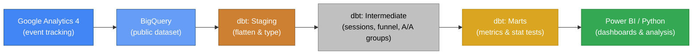

# GA4 Conversion Funnel Analysis & A/B Test Simulation

`Google BigQuery` | `dbt` | `SQL` | `Python` | `Jupyter Notebook` | `Google Cloud Platform` | `Git` | `Claude Code`

> 🚧 **Status:** Work in progress

---

## Table of Contents
- [Business Context](#business-context)
- [Objective](#objective)
- [Architecture](#architecture)
- [Project Structure](#project-structure)
- [Key Results](#key-results)
- [How to Run](#how-to-run)
- [Dataset](#dataset)
- [Sample Data](#sample-data)
- [Limitations](#limitations)
- [Contact](#contact)

---

## Business Context

The [Google Merchandise Store](https://shop.googlemerchandisestore.com/) is an ecommerce site selling Google-branded products. Like many online retailers, it faces a core conversion challenge: the vast majority of visitors leave without purchasing.

Using 3 months of anonymised GA4 event data (Nov 2020 -- Jan 2021), this project investigates **where users drop off** in the purchase funnel and builds the **statistical infrastructure** needed to evaluate future conversion experiments.

Out of **360,129 sessions**, only **4,848 resulted in a purchase** — an overall conversion rate of **1.35%**.

---

## Objective

### 1. Funnel Analysis
Identify the biggest drop-off points in the ecommerce conversion funnel:

`session_start` &rarr; `view_item` &rarr; `add_to_cart` &rarr; `begin_checkout` &rarr; `purchase`

### 2. A/A Test Simulation
Validate the statistical testing pipeline by running an A/A test — splitting users into two groups that both saw the **identical** website. The expected result: no statistically significant difference between groups, confirming the pipeline is sound before running real A/B experiments.

---

## Architecture



| Layer | Purpose | Materialization |
|-------|---------|-----------------|
| **Staging** | Flatten nested GA4 event_params, unpack structs | `table` |
| **Intermediate** | Session aggregation, funnel flags, A/A group assignment | `table` |
| **Marts** | Funnel conversion rates by group/device, z-test results | `table` |

---

## Project Structure

```
ga4-bigquery-ab-testing/
├── README.md
├── LICENSE
├── docs/
│   └── dag.md                          # Mermaid DAG diagram
├── notebooks/
│   ├── eda.ipynb                       # Exploratory data analysis (WIP)
│   └── requirements.txt               # Python dependencies
└── dbt/
    └── ga4_funnel/
        ├── dbt_project.yml
        ├── packages.yml                # dbt_utils dependency
        ├── models/
        │   ├── staging/
        │   │   ├── stg_ga4__events.sql # Flatten raw GA4 events
        │   │   ├── sources.yml
        │   │   └── schema.yml
        │   ├── intermediate/
        │   │   ├── int_sessions.sql    # Session-level aggregation
        │   │   ├── int_user_funnel.sql # Funnel step flags per session
        │   │   ├── int_aa_test_groups.sql  # Deterministic A/A split
        │   │   ├── schema.yml
        │   │   └── unit_tests.yml      # 4 unit tests
        │   └── marts/
        │       ├── mart_funnel_metrics.sql     # Funnel rates by group & device
        │       ├── mart_aa_test_results.sql    # Z-test statistical comparison
        │       └── schema.yml
        └── seeds/                      # Sample data exports
            ├── seed_mart_funnel_metrics.csv
            ├── seed_mart_aa_test_results.csv
            └── seed_stg_ga4__events_sample.csv
```

---

## Key Results

### Conversion Funnel

| Funnel Step | Sessions | % of Total | Step Drop-off |
|-------------|----------|------------|---------------|
| Session Start | 354,857 | 100% | — |
| View Item | 77,020 | 21.7% | **78.3% leave without viewing a product** |
| Add to Cart | 15,188 | 4.3% | 80.3% of viewers don't add to cart |
| Begin Checkout | 11,106 | 3.1% | 26.9% abandon after adding to cart |
| Purchase | 4,848 | 1.4% | 56.3% drop off at checkout |

**Key insight:** The largest drop-off occurs at the very first step — **78.3% of sessions end without the user viewing a single product**. This suggests the homepage and category pages need attention before optimising the checkout flow.

### A/A Test Validation

| Metric | Control | Treatment |
|--------|---------|-----------|
| Sessions | 180,227 | 179,902 |
| Purchases | 2,458 | 2,390 |
| Conversion Rate | 1.36% | 1.33% |
| Revenue | $160,024 | $158,766 |

| Statistical Test | Value |
|------------------|-------|
| Z-score | -0.92 |
| Significant at 90%? | No |
| Significant at 95%? | No |
| Significant at 99%? | No |

**Result:** No significant difference between groups (as expected). The pipeline correctly identifies that two identical experiences produce no measurable lift — confirming it is ready for real A/B testing.

---

## How to Run

### Prerequisites
- Python 3.8+
- [dbt-core](https://docs.getdbt.com/docs/core/installation) with `dbt-bigquery` adapter
- Google Cloud project with BigQuery API enabled
- `gcloud` CLI authenticated (`gcloud auth application-default login`)

### Setup

```bash
# 1. Clone the repository
git clone https://github.com/your-username/ga4-bigquery-ab-testing.git
cd ga4-bigquery-ab-testing

# 2. Configure dbt profile (~/.dbt/profiles.yml)
#    Set project, dataset, and location: US

# 3. Install dbt packages
cd dbt/ga4_funnel
dbt deps

# 4. Verify connection
dbt debug

# 5. Build all models and run tests
dbt build --select staging+

# Expected: 26 PASS, 0 ERROR
```

---

## Dataset

- Anonymised event-level data from the Google Merchandise Store, collected via Google Analytics 4 (GA4)
- **Source:** [Google BigQuery Public Dataset](https://developers.google.com/analytics/bigquery/web-ecommerce-demo-dataset)
- **Name:** `bigquery-public-data.ga4_obfuscated_sample_ecommerce`
- **Time Range:** 1 Nov 2020 -- 31 Jan 2021
- **Volume:** ~4.3M events, ~270K users, ~360K sessions

### Sample Data (seeds/)

| File | Rows | Description |
|------|------|-------------|
| `seed_stg_ga4__events_sample.csv` | 10 | Raw flattened GA4 events showing the structure after unnesting event_params, device, geo, and traffic_source fields |
| `seed_mart_funnel_metrics.csv` | 6 | Funnel conversion rates by A/A test group and device category |
| `seed_mart_aa_test_results.csv` | 1 | A/A test summary: z-score, lift, significance flags |

---

## Limitations

- **Fixed 3-month window** — The dataset covers Nov 2020 -- Jan 2021 only. No seasonality or long-term trend analysis is possible.
- **A/A simulation, not a real experiment** — Users were split post-hoc via `FARM_FINGERPRINT`. Both groups saw the same website. This validates the pipeline but does not measure any treatment effect.
- **No p-value in SQL** — BigQuery lacks a native normal CDF function. The z-score and significance thresholds are computed in dbt; exact p-values will be calculated in the Python analysis notebook via `scipy.stats`.
- **First-touch attribution only** — The `traffic_source` field in GA4 reflects first-touch attribution, not session-level source. This limits acquisition analysis.

---

## Contact

**Project author:** Elizaveta Gvozdina<br>
**LinkedIn:** [linkedin.com/in/gvozdina](https://www.linkedin.com/in/gvozdina/)<br>
**Email:** lisagvozdina@gmail.com
