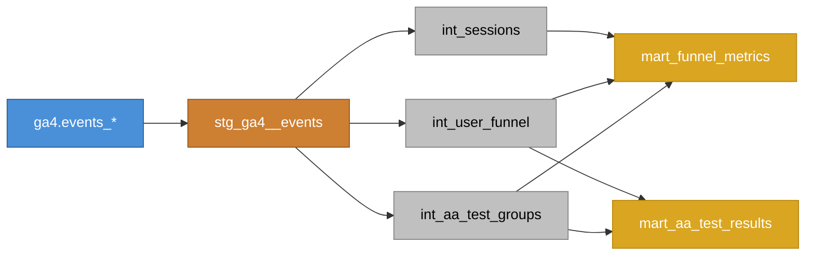

# dbt Model Lineage (DAG)

**Legend:**
- Blue — Source (BigQuery public dataset)
- Bronze — Staging (flattened, typed)
- Silver — Intermediate (sessions, funnel, A/A groups)
- Gold — Marts (aggregated metrics, statistical tests)
